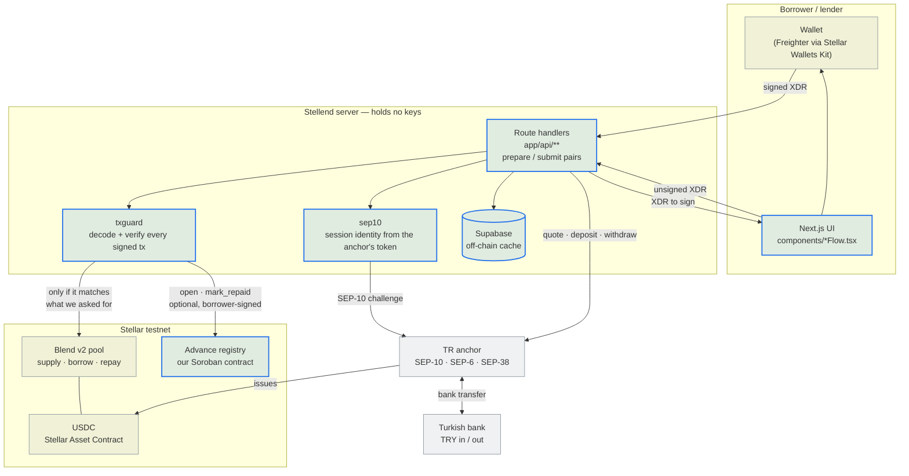

# Stellend

Turkish lira in and out of a Stellar lending pool. Two flows, one pool:

- **Get cash without selling your crypto.** Lock a Soroban asset as collateral, borrow USDC
  against it in a [Blend](https://blend.capital) v2 pool, and have the anchor pay the lira
  out to your bank account.
- **Earn dollar yield on lira savings.** Send TRY by bank transfer, the anchor converts it
  to USDC, and it is supplied to the same pool as lending liquidity.

Both sides are non-custodial: the server prepares unsigned transactions, your wallet signs
them, and no private key ever reaches this application.

> **This is a testnet proof of concept.** It runs against Stellar testnet, a Blend testnet
> pool, and a mock TRY anchor. There is no production TRY anchor on Stellar, and operating
> this in Turkey has unresolved licensing requirements. Do not point it at mainnet.
> See [docs/BUSINESS-MODEL.md](docs/BUSINESS-MODEL.md) for who it is for and what would have
> to be true to run it for real.

## How a cash advance works

Four signed transactions and one bank transfer. The order matters: nothing touches the chain
until the anchor has agreed to pay out, so a borrower can never end up with debt and no way
to cash out.

```
1. reserve      POST /api/loans/borrow/start
                → SEP-38 quote + SEP-6 withdraw; writes the "borrow intent" row
                  (amounts, anchor destination) every later step is checked against

2. trustline    POST /api/loans/trustline/{prepare,submit}      [skipped if present]
3. collateral   POST /api/loans/collateral/{prepare,submit}     ← wallet signs
4. borrow       POST /api/loans/borrow/{prepare,submit}         ← wallet signs
5. payout       POST /api/loans/borrow/payout/{prepare,submit}  ← wallet signs
                → pays the borrowed USDC to the anchor's account
                  **advance is complete here**

6. record       POST /api/loans/borrow/record/{prepare,submit}  ← wallet signs   [optional]
                → writes a borrower-signed statement to the advance registry contract;
                  can be skipped, declined, and retried later — it is not a gate

7. settle       anchor observes the payment, sends TRY to the IBAN
                GET /api/withdraw/[id]/status flips the loan to `active`
```

If the flow is interrupted between any two steps, `GET /api/loans/borrow/resume` reports
which step it stopped at and the UI picks it back up — including the state that matters
most, where the USDC is borrowed but has not reached the anchor yet.

Deposits mirror this: quote → SEP-6 deposit → bank transfer → `Supply` into the pool.

## Architecture



```
components/       React flows (BorrowFlow, DepositFlow, RepayFlow, …) — build, sign, submit
app/api/          Route handlers; prepare/submit pairs per on-chain action
lib/blend.ts      Soroban: builds and submits pool transactions, reads positions
lib/anchor.ts     SEP-10 auth, SEP-6 deposit/withdraw, SEP-38 quotes
lib/txguard.ts    Decodes a signed transaction and checks it is the one we asked for
lib/sep10.ts      Ties the session to the account the anchor's token names
lib/liquidity.ts  Pure: utilisation caps, loan timing, position risk
supabase/         Off-chain index. The chain and the anchor are the source of truth;
                  these tables only cache state so the UI is fast
contracts/        Our own Soroban contract — the borrower-signed advance registry
```

**The chain is authoritative.** Supabase rows are a cache. Where the two disagree the code
prefers the chain — `staleLoanIds` reconciles loan rows against live debt, and the repay
route reads the pool to decide whether a loan is settled rather than trusting the client.

## Security model

The wallet signs everything, so a malicious client can only ever spend its own funds. What
it could once do was *misreport* what it spent, which is what our off-chain records are
built from. Three things close that:

- **Session identity comes from the anchor's token**, never the request body
  ([lib/sep10.ts](lib/sep10.ts)). A valid SEP-10 challenge signed with your own key cannot
  open a session for someone else's account.
- **Every submitted transaction is decoded and checked** before it is sent
  ([lib/txguard.ts](lib/txguard.ts)): correct source account, correct contract, correct
  action, and an amount bound in whichever direction the step can be gamed.
- **Amounts are read from the server's own records**, not from the client. The loan row is
  written from the reserved intent, not from what the browser claims it borrowed.

Also: the session cookie is AES-256-GCM encrypted (it carries the anchor's bearer token),
production refuses to start with a placeholder `SESSION_COOKIE_SECRET`, and
[proxy.ts](proxy.ts) applies origin checks and rate limits to every API route.

## The advance registry contract

`contracts/advance-registry` is the one contract we wrote ourselves ([source](contracts/advance-registry/src/lib.rs)).

It exists because of a weakness in everything above: the borrower's side of an advance —
how much fiat they were paid, against how much debt, and when they said they would close
it — lived only in a Postgres table that we control. Nothing stopped us rewriting it
afterwards, and a borrower had no independent copy to point at. The registry is that
copy. The borrower signs the record themselves, so it is written under *their*
authorisation, not ours.

| Function | What it does |
|---|---|
| `open` | Records an advance. Requires the borrower's own signature; rejects duplicate ids, non-positive amounts, and dates in the past or more than a year out |
| `mark_repaid` | Borrower declares the advance settled. Once only |
| `get` / `is_overdue` | Reads the record; reports whether an open advance is past its committed date |
| `count` / `list` | The borrower's history, paged |

What it deliberately does **not** do: hold funds, move funds, or enforce anything. The
debt lives in the Blend pool and the pool stays authoritative. `due_at` is a commitment
the borrower signed, not a trigger — nothing on Stellar can force a perpetual position
to close on a date, and the contract does not pretend otherwise.

Design notes worth their space:

- **No admin key.** There is no operator role, so there is nothing for us to abuse and
  no key to lose. A record can only ever be written or closed by its own borrower.
- **The payout reference is a hash, not an IBAN.** An IBAN is personal data and has no
  business on a public ledger, but a borrower holding the originals can still prove
  which payout a record covers.
- **The per-borrower index is one entry per position, not a growing `Vec`.** Appending
  costs the same on a borrower's hundredth advance as on their first, and `list` is
  paged so the cost of reading a history is bounded.
- **TTLs are extended on read as well as write**, so an advance anyone is still
  watching cannot be archived out from under it.

**Status: deployed on testnet, and the server calls it.** `open` is wired to
`/api/loans/borrow/record/{prepare,submit}` and `mark_repaid` to
`/api/loans/[id]/registry/close/{prepare,submit}`; every argument is derived server-side
from the borrow intent and checked by [lib/txguard.ts](lib/txguard.ts) before submission.
The whole feature is gated on `NEXT_PUBLIC_ADVANCE_REGISTRY_ID` — with no contract id
configured the routes answer 404 and the step simply does not exist.

Recording is **optional and never a gate**: the advance is complete at payout. The UI
offers the signature once the cash is on its way ([components/BorrowFlow.tsx](components/BorrowFlow.tsx))
and again, later, from the advances list ([components/LoansList.tsx](components/LoansList.tsx)),
which also offers `mark_repaid` once an advance is repaid. Declining costs the borrower
nothing and `borrowStage` never looks at it — the moment a receipt gates something, it
stops being a receipt.

Still missing: nothing *reads* the contract. `get`, `list` and `count` are uncalled, so a
borrower sees our cached "recorded" flag rather than the chain itself.

Build, test and deploy it:

```bash
cd contracts
cargo test                                    # 13 unit tests
stellar contract build                        # → target/wasm32v1-none/release/advance_registry.wasm
stellar keys generate deployer --network testnet --fund
stellar contract deploy \
  --wasm target/wasm32v1-none/release/advance_registry.wasm \
  --source deployer --network testnet
```

## Deployed artifacts

Everything below is live on **Stellar testnet** and was verified against it, not copied
from a config file.

| What | Id | Explorer |
|---|---|---|
| **Advance registry** (ours) | `CC2F5JAI2REPM4CMKLSI3EMFBNHVMPOEVY7GARSCHTNHEOL536NOVWQF` | [stellar.expert](https://stellar.expert/explorer/testnet/contract/CC2F5JAI2REPM4CMKLSI3EMFBNHVMPOEVY7GARSCHTNHEOL536NOVWQF) · [lab](https://lab.stellar.org/r/testnet/contract/CC2F5JAI2REPM4CMKLSI3EMFBNHVMPOEVY7GARSCHTNHEOL536NOVWQF) |
| Blend v2 pool | `CAPBMXIQTICKWFPWFDJWMAKBXBPJZUKLNONQH3MLPLLBKQ643CYN5PRW` | [stellar.expert](https://stellar.expert/explorer/testnet/contract/CAPBMXIQTICKWFPWFDJWMAKBXBPJZUKLNONQH3MLPLLBKQ643CYN5PRW) |
| USDC (Stellar Asset Contract) | `CBIELTK6YBZJU5UP2WWQEUCYKLPU6AUNZ2BQ4WWFEIE3USCIHMXQDAMA` | [stellar.expert](https://stellar.expert/explorer/testnet/contract/CBIELTK6YBZJU5UP2WWQEUCYKLPU6AUNZ2BQ4WWFEIE3USCIHMXQDAMA) |
| USDC issuer | `GBBD47IF6LWK7P7MDEVSCWR7DPUWV3NY3DTQEVFL4NAT4AQH3ZLLFLA5` | [stellar.expert](https://stellar.expert/explorer/testnet/account/GBBD47IF6LWK7P7MDEVSCWR7DPUWV3NY3DTQEVFL4NAT4AQH3ZLLFLA5) |
| TR anchor (SEP-10/6/38) | `https://tr-mock-anchor.fly.dev` | [stellar.toml](https://tr-mock-anchor.fly.dev/.well-known/stellar.toml) |

Registry build details — `soroban-sdk` 28.0.0, target `wasm32v1-none`, 9,148 bytes
optimized:

| | |
|---|---|
| Wasm hash | `d11188efa8734bbe560156bb7d0abd1cdca0c37af71a8f173716b33cd7d28947` |
| Deploy tx | [`71ebb068…`](https://stellar.expert/explorer/testnet/tx/71ebb0687195a0f02ee5befbd3f53692eb25ba35785391ecb1efcc3d744d5249) |

## Known limitations

These are real and deliberate, not oversights:

- **There is no term, and the product no longer pretends there is one.** Blend is a
  perpetual market: interest accrues from the first ledger and keeps accruing, and the only
  thing that ever forces a position to close is its health factor. `due_at` is a *target*
  close date we suggest, nothing enforces it, and the UI says so. What borrowers are shown
  instead is what they owe right now, what today's interest costs, and how far their
  collateral can fall before it is sold — all read live from the pool. The advance
  registry records the date the borrower *committed* to, which makes the commitment
  auditable by anyone; it still does not make it enforceable, and nothing on Stellar could.
- **No liquidation bot.** Blend liquidation is two permissionless steps, and we do neither:
  someone must call `newAuction` to open a Dutch auction on an underwater position, and
  someone with capital must fill it by repaying the debt in exchange for the collateral. We
  warn the borrower as their margin narrows, but if no external liquidator turns up, the
  loss lands on lenders. Whether they turn up for our collateral is untested.
- **One anchor, and it is a mock.** Every fiat leg depends on a single SEP-6 anchor.
- **No KYC.** SEP-12 is not implemented; a real anchor would require it.
- **Debt is per wallet, loans are per row.** Blend tracks one debt position per account, so
  mapping it back onto individual loan records is an approximation.
- **Registry records an advance before settlement is confirmed.** The advance registry `open`
  call (step 6) is written after the USDC payout lands but before the anchor has confirmed
  sending the TRY. If the anchor then fails or refunds, a permanent on-chain record exists
  claiming the borrower received lira they did not. The contract has no `void`. The frequency
  of this scenario is unknown against a mock anchor; a `void` entry point or post-settlement
  recording will be designed once Phase 2 pilot data is available.


## Documentation

[docs/](docs/README.md) is the index. In short:
[architecture](docs/ARCHITECTURE.md) (trust model, flows, resume),
[API reference](docs/API.md),
[data model](docs/DATA-MODEL.md),
[the advance-registry contract](docs/CONTRACT-ADVANCE-REGISTRY.md) and
[how it would be wired in](docs/ARCHITECTURE-advance-registry.md),
[ecosystem context](docs/ECOSYSTEM.md),
[business model](docs/BUSINESS-MODEL.md) and
[what is next](docs/PRD.md).

## Getting started

```bash
npm install
cp .env.example .env.local     # fill in Supabase, pool and anchor values
npm run dev                    # http://localhost:3000
```

Apply the database schema:

```bash
DATABASE_URL=postgres://... npm run db:apply
```

Checks:

```bash
npm run typecheck
npm run lint
npm test                       # 105+ tests
(cd contracts && cargo test)   # 13 contract tests
```

Building the contract additionally needs the Rust `wasm32v1-none` target and
[stellar-cli](https://developers.stellar.org/docs/tools/cli/stellar-cli) 25.2+ —
`soroban-sdk` 28 refuses to build a contract without it.

### Environment

See [.env.example](.env.example). The ones without defaults:

| Variable | What it is |
|---|---|
| `NEXT_PUBLIC_SUPABASE_URL`, `SUPABASE_SERVICE_ROLE_KEY` | Off-chain index. API routes use the service role; the browser never touches these tables |
| `NEXT_PUBLIC_BLEND_POOL_ID` | Blend v2 pool contract |
| `NEXT_PUBLIC_USDC_CONTRACT_ID` | The pool's USDC. Must be the same asset the anchor issues, or payouts can never settle |
| `SESSION_COOKIE_SECRET` | Encrypts the session cookie. Required in production; `openssl rand -base64 32` |
| `CRON_SECRET` | Bearer token for `POST /api/keeper/sync-loans`, which reconciles loan status against on-chain positions on a schedule |
| `NEXT_PUBLIC_ADVANCE_REGISTRY_ID` | Our advance registry contract. See [Deployed artifacts](#deployed-artifacts) |

## Stellar skills used

Built with the official skill files from [skills.stellar.org](https://skills.stellar.org),
which are worth naming specifically because they changed the code rather than just
confirming it:

| Skill file | Where it landed |
|---|---|
| `skills/smart-contracts/SKILL.md` | Contract anatomy, the `wasm32v1-none` target, the release profile in [contracts/Cargo.toml](contracts/Cargo.toml), and the `#[contractevent]` event API that replaced the deprecated `env.events().publish(...)` |
| `skills/smart-contracts/development.md` | The storage chapter is why the per-borrower index is one entry per position instead of one growing `Vec`, why keys go through a typed `DataKey` enum, and why `due_at` is checked in the value rather than leaned on TTL expiry — "TTL expiry is not a security mechanism" |
| `skills/standards/SKILL.md` | Choosing the fiat rail's standards — its "anchor integration for fiat rails" mapping is why we took SEP-6 (API-first, our own UI) over SEP-24 (hosted, interactive), and it names SEP-12 as the KYC gap we still have |
| `skills/dapp/SKILL.md` | Stellar Wallets Kit wiring and the prepare/sign/submit split that keeps private keys out of the server |
