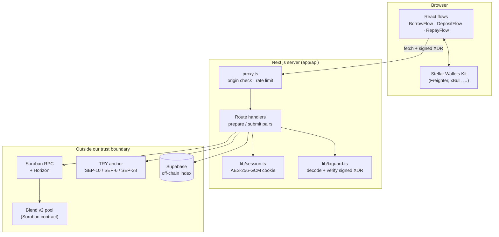
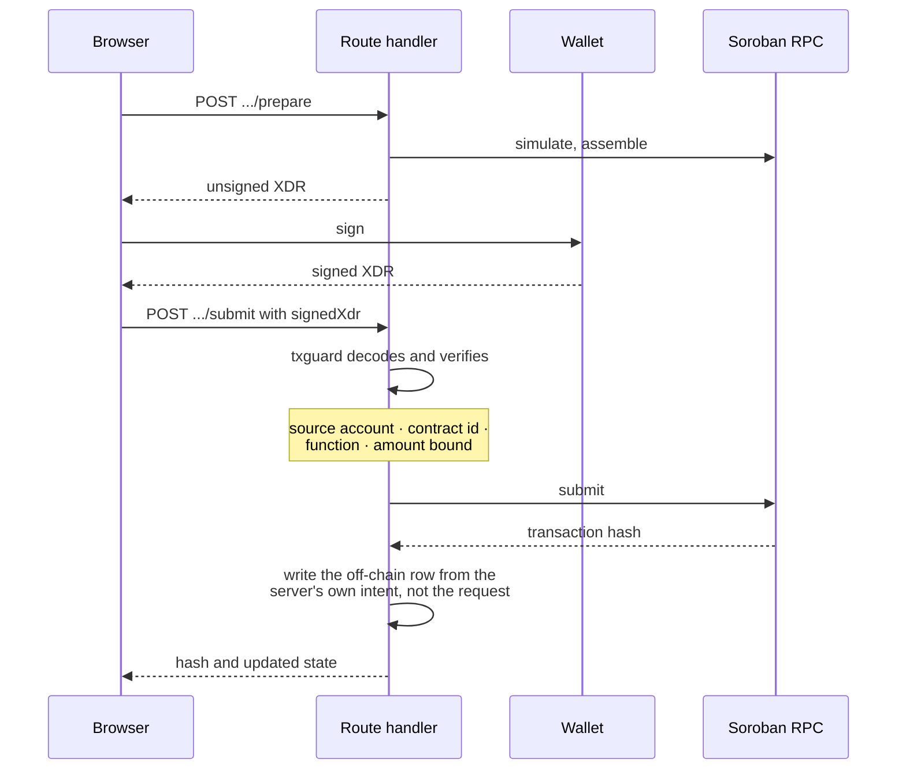
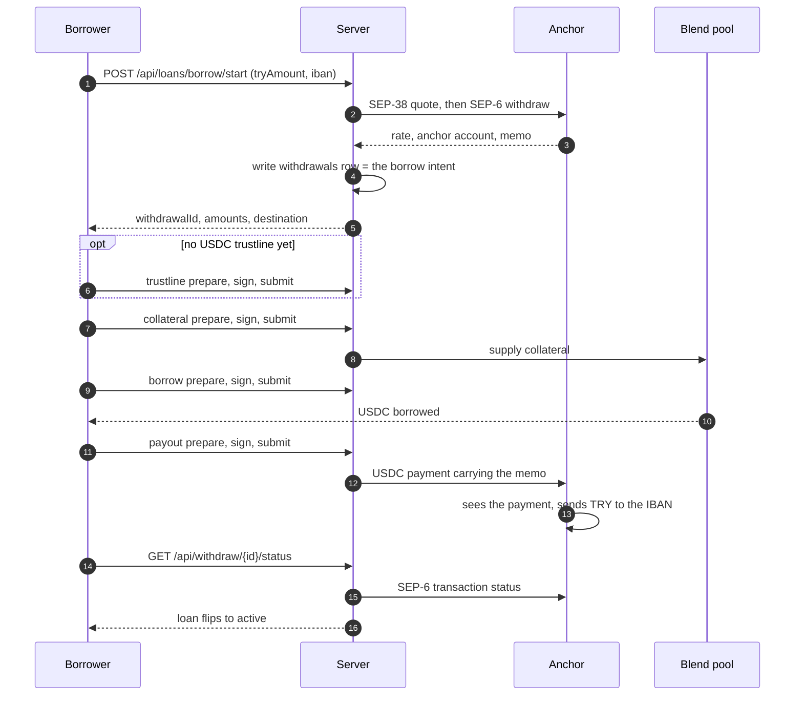
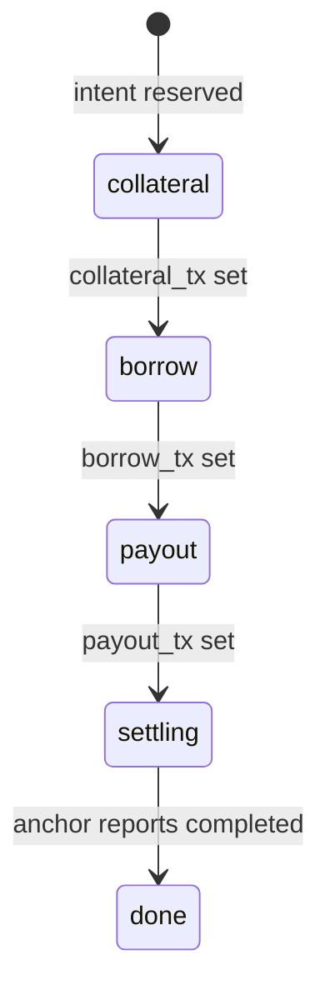
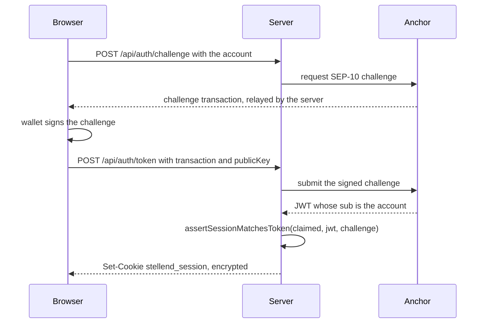

# Architecture

How Stellend is put together, and why each piece is where it is. Read
[../README.md](../README.md) first for what the product does; this document is about the
machinery underneath it.

## The one idea to hold on to

**The server never holds a key, and the client is never trusted.**

Everything else follows from that. The server can *prepare* a transaction and *check* a
signed one, but it cannot sign. The browser can sign, but nothing it claims about what it
signed is believed — the server decodes the XDR and checks it against its own records
before submitting. Anywhere those two rules seem to conflict with convenience, the rules
win.

## Layers

Three things in that picture are worth noticing:

1. **`proxy.ts` sits in front of every API route.** In Next.js 16 middleware was renamed
   to Proxy; the file lives at the project root and its `config.matcher` is `/api/:path*`.
   It rejects cross-site mutating requests and applies two rate-limit budgets — 120
   requests per minute in general, 12 per minute for routes that cost an anchor round trip
   or a wallet signature.
2. **The wallet is outside the server box.** No arrow carries a secret key inward.
3. **Supabase is drawn with the external systems, not inside the server.** It is a cache,
   not an authority — see [Where truth lives](#where-truth-lives).

## Where truth lives

| Question | Authority | Cache |
|---|---|---|
| How much does this wallet owe? | Blend pool, read live | `loans.borrowed_usdc_amount` |
| Is this collateral safe? | Blend pool position health | nothing — always read live |
| Did the anchor pay the lira out? | Anchor's SEP-6 transaction status | `withdrawals.status` |
| Who is this request from? | The anchor's SEP-10 token | the session cookie carrying it |
| What was this advance for? | `withdrawals` row (the borrow intent) | — |

Where a cache and its authority disagree, the code prefers the authority: `staleLoanIds`
in [../lib/profile.ts](../lib/profile.ts) reconciles loan rows against live debt, and the
repay route reads the pool to decide whether a loan is settled rather than trusting what
the client says it repaid.

## The prepare / submit pattern

Every on-chain action is two endpoints, never one:

`prepare` is stateless and cheap to retry. `submit` is the only place that writes, and it
writes from the intent the server recorded earlier — never from numbers in the request
body. That is what stops a malicious client logging a loan that does not match the chain.

### What txguard actually checks

[../lib/txguard.ts](../lib/txguard.ts) refuses a transaction unless all of this holds:

- it parses as a `Transaction` for the configured network — **fee-bump wrappers are
  rejected outright**, because the inner transaction would be the one that ran;
- its source is the signed-in account, and it carries exactly one operation whose own
  source, if set, is also that account;
- for a pool call: the contract is our pool, the function is `submit`, and the decoded
  requests act only on the signed-in wallet;
- the amount is bounded *in whichever direction that step could be gamed* — a borrow
  cannot exceed what was reserved, a collateral deposit cannot fall short of it.

A failure raises `TransactionMismatchError` and nothing is submitted.

## The cash advance, end to end

The ordering is the security property: **nothing touches the chain until the anchor has
agreed to pay out**, so a borrower can never end up holding debt with no way to cash out.

### Resuming an interrupted advance

The `withdrawals` row records the hash of each step that has already landed
(`collateral_tx`, `borrow_tx`, `payout_tx`). `borrowStage()` in
[../lib/borrowIntent.ts](../lib/borrowIntent.ts) turns those three columns plus the row
status into exactly one stage:

`GET /api/loans/borrow/resume` reports that stage and the UI picks the flow back up. The
stage that matters most is `payout`: the USDC is borrowed but has not reached the anchor,
so the borrower has debt and no cash. Losing that state would lose their money.

**The advance registry is deliberately outside this machine.** Signing the on-chain record
is a sixth step, but it is not a stage: `borrowStage` never looks at `registry_tx`, so an
unrecorded advance is `done` like any other. The resume payload carries `registryRecorded`
alongside the stage, and the UI offers the signature without blocking on it. The reasoning
is that the record exists for the borrower's benefit, so refusing it must cost them
nothing — the moment it gates anything, it stops being a receipt and becomes a hurdle.

## Module map

| Path | Responsibility |
|---|---|
| [../components/](../components/) | React flows. Build, sign, submit; they own no business rules |
| [../app/api/](../app/api/) | Route handlers, one prepare/submit pair per on-chain action |
| [../lib/blend.ts](../lib/blend.ts) | Soroban: builds pool transactions, submits them, reads positions |
| [../lib/anchor.ts](../lib/anchor.ts) | SEP-1 TOML, SEP-10 auth, SEP-6 deposit/withdraw, SEP-38 quotes, limit checks |
| [../lib/txguard.ts](../lib/txguard.ts) | Decodes a signed transaction and checks it is the one we asked for |
| [../lib/sep10.ts](../lib/sep10.ts) | Ties the session to the account the anchor's token names |
| [../lib/session.ts](../lib/session.ts) | AES-256-GCM session cookie carrying the anchor bearer token |
| [../lib/liquidity.ts](../lib/liquidity.ts) | Pure functions: utilisation caps, loan timing, position risk |
| [../lib/borrowIntent.ts](../lib/borrowIntent.ts) | Loads the intent row and derives the resume stage |
| [../lib/registry.ts](../lib/registry.ts) | Advance registry: the feature gate, the two content-addressed hashes, and the `open`/`mark_repaid` builders |
| [../lib/profile.ts](../lib/profile.ts) | Summarises a wallet's position; reconciles stale loan rows |
| [../lib/ratelimit.ts](../lib/ratelimit.ts), [../lib/audit.ts](../lib/audit.ts) | In-process rate limiting; security audit trail |
| [../supabase/](../supabase/) | Schema and migrations for the off-chain index |
| [../contracts/](../contracts/) | `advance-registry` Soroban contract — see [CONTRACT-ADVANCE-REGISTRY.md](CONTRACT-ADVANCE-REGISTRY.md) |

## Session and identity

`assertSessionMatchesToken` is the load-bearing line: the session's public key comes from
the anchor's token `sub` and the signed challenge, **never from the request body**. Signing
a valid challenge with your own key cannot open a session for someone else's account.

The cookie is encrypted with AES-256-GCM rather than merely signed, because it carries the
anchor's bearer token — a credential in its own right. In production the app refuses to
start if `SESSION_COOKIE_SECRET` is still the placeholder or shorter than 32 characters.

> **Stale comment worth fixing:** the note beside `SESSION_COOKIE_SECRET` in
> [../.env.example](../.env.example) says the cookie is HMAC-signed. It is encrypted
> (AES-256-GCM, whose auth tag also makes tampering detectable). The behaviour is correct;
> the comment is not.

## Limits that are enforced

| Limit | Where | Value |
|---|---|---|
| Pool utilisation cap on new borrows | `lib/liquidity.ts` | 85% |
| Borrower warning threshold | `lib/liquidity.ts` | collateral/debt below 1.2 |
| Target close date (advisory only) | `lib/liquidity.ts` | 30 days, 3-day grace for reporting |
| API requests per client | `proxy.ts` | 120/min, 12/min on expensive routes |
| Anchor deposit and withdraw min/max | `lib/anchor.ts`, `assertWithinSep6Limits` | from the anchor's SEP-6 `/info` |

Nothing enforces the close date on chain, and nothing can — see
[ECOSYSTEM.md](ECOSYSTEM.md#why-there-is-no-loan-term).
