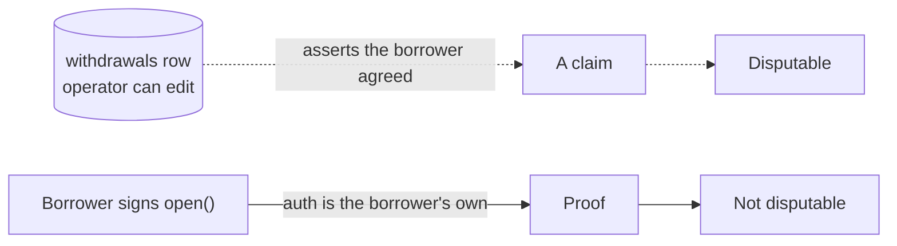

# `advance-registry` — the borrower's own copy of the record

Source: [../contracts/advance-registry/src/lib.rs](../contracts/advance-registry/src/lib.rs)

> **Status: deployed on testnet and called by the server.** [../lib/registry.ts](../lib/registry.ts)
> builds the transactions, [../lib/txguard.ts](../lib/txguard.ts) verifies them, and four
> routes expose them — see [API.md](API.md#post-apiloansborrowrecordpreparesubmit--step-6-optional).
> The feature is gated on `NEXT_PUBLIC_ADVANCE_REGISTRY_ID`; with no contract id those
> routes answer 404 and the step does not exist. See
> [What is still missing](#what-is-still-missing).

## Why it exists

Stellend keeps its advance records in Postgres, and that is a real weakness. The borrower's
side of the agreement — how much fiat they were paid, against how much debt, and when they
said they would close it — exists only in a table the operator controls. Nothing stops
that table being rewritten after the fact, and the borrower has no independent copy to
point at.

This contract is the independent copy. The borrower signs a record of what they agreed to,
and it lands on chain **under their own authorisation**. Neither the operator nor a later
migration can alter it.



## What it deliberately does not do

Read this list before reading the API, because it is most of the design:

- **It holds no funds and can move none.** The debt lives in the Blend pool.
- **It does not enforce the close date.** Blend is a perpetual market; nothing on Stellar
  can force a position to close on a date. `due_at` is a commitment the borrower signed,
  and `is_overdue` only *reports* the fact.
- **It is not the authority on whether a debt is outstanding.** The pool is. A borrower who
  never calls `mark_repaid` leaves a stale `Open` record, which costs them their own good
  standing and nothing else.

## Data

```rust
pub struct Advance {
    pub borrower: Address,     // signed this record; holds the debt in the pool
    pub usdc_amount: i128,     // debt drawn, in USDC stroops (7 dp)
    pub try_amount: i128,      // fiat paid out, in TRY minor units (2 dp)
    pub payout_ref: BytesN<32>,// hash of the anchor withdrawal id + destination
    pub opened_at: u64,
    pub due_at: u64,           // committed, not enforced
    pub status: Status,        // Open | Repaid
}
```

`payout_ref` is a **hash, not the values**. An IBAN is personal data and has no business on
a public ledger, but a borrower holding the originals can still prove which payout a record
covers. That is the whole trick: verifiability without publication.

## Functions

| Function | Auth | Behaviour |
|---|---|---|
| `open(borrower, id, usdc_amount, try_amount, payout_ref, due_at)` | `borrower` | Records a new advance. Errors on a duplicate id, a non-positive amount, or a `due_at` in the past or more than ~1 year ahead. Emits `Opened` |
| `mark_repaid(borrower, id)` | `borrower` | Flips `Open` → `Repaid`, once. Emits `Repaid` |
| `get(borrower, id)` | none | The record. Reading extends its TTL |
| `is_overdue(borrower, id)` | none | `true` only for an `Open` record past its `due_at`. Reporting only |
| `count(borrower)` | none | How many advances this borrower has opened. `0` for an unknown account |
| `list(borrower, start, limit)` | none | A page of that borrower's ids, oldest first. `limit` is clamped to `MAX_PAGE` (100); a window running off the end stops at the end, and a start past the end is empty, not an error |

Every function takes `borrower` explicitly, including the read paths, because the record is
keyed by `(borrower, id)` rather than by `id` alone — see [Storage](#storage-and-ttl).

### Errors

| Variant | Code | Raised when |
|---|---|---|
| `AlreadyExists` | 1 | The id is taken. Ids are content-addressed by the caller, so a repeat means a replayed request, not a new advance |
| `NotFound` | 2 | No record with that id |
| `InvalidAmount` | 3 | An amount is not strictly positive |
| `InvalidDueDate` | 4 | `due_at` is in the past, or beyond `MAX_TERM_SECONDS` (~1 year) |
| `NotOpen` | 5 | The record is already closed |

### Events

`Opened { borrower (topic), id, usdc_amount, try_amount, due_at }` and
`Repaid { borrower (topic), id }`. `borrower` is a topic so an indexer can follow one
account without replaying the whole ledger.

## How the ids are derived

Both hashes live in [../lib/registry.ts](../lib/registry.ts) and are **compatibility
surfaces**: their output is written to an immutable on-chain record, so changing either one
orphans every record already written.

```
advance_id  = sha256("stellend-advance-v1|" + withdrawalId)
payout_ref  = sha256("stellend-payout-v1|" + anchorRef + "|" + normalizeIban(iban))
```

The domain prefixes keep the two from ever colliding, and version them for the day one has
to change. Two consequences worth stating out loud:

- **`payout_ref` depends on `normalizeIban`.** That function's output is therefore part of
  the contract surface too. If its normalisation changes — a stripped space, a case rule —
  borrowers can no longer reproduce the hash for old records, and the proof stops working.
  Any change there has to be coordinated with this hash, or versioned past it.
- **Determinism is what makes retries safe.** A retried step 6 rebuilds the same
  `advance_id`, the contract answers `AlreadyExists`, and the flow treats that as success:
  the record we wanted is already there. [../test/registry.test.ts](../test/registry.test.ts)
  pins both with fixed vectors for exactly this reason.

## Idempotency

`id` is chosen by the caller and must be unique. Stellend derives it from the borrow
intent, which makes a retried submission fail with `AlreadyExists` rather than writing a
second record for the same advance. This mirrors how the web flow already treats retries
(see [ARCHITECTURE.md](ARCHITECTURE.md#resuming-an-interrupted-advance)) — retry is safe,
duplication is not.

## Storage and TTL

Records are keyed by **`(borrower, id)`**, not by `id` alone:

```rust
enum DataKey {
    Advance(Address, BytesN<32>),  // the record itself
    Count(Address),                // how many this borrower has opened
    At(Address, u32),              // their n-th id, oldest first
}
```

Two decisions are buried in those three lines:

- **Namespacing by borrower makes id squatting impossible.** Without it, a third party
  could open a record under a guessed id and block the real borrower from ever recording
  their advance. The ids are unguessable anyway — but construction is stronger than
  entropy, and the test suite pins the behaviour
  (`a_different_borrower_cannot_squat_an_id`).
- **The index is `Count` + `At(n)`, not a growing `Vec`.** Appending costs the same on a
  borrower's hundredth advance as on their first, and a read is bounded by the page size
  instead of by their whole history.

Entries are TTL-extended on **every write and every read**:

```rust
const TTL_THRESHOLD: u32 = 518_400;    // ~30 days of ~5s ledgers
const TTL_EXTEND_TO: u32 = 1_036_800;  // bump back to ~60 days
```

An advance still being serviced — or merely still being watched — cannot be archived out
from under us. Background on Soroban state archival:
<https://developers.stellar.org/docs/build/guides/archival/extend-persistent-entry-js>.

## Build and test

```bash
cd contracts
cargo test                          # unit tests, with snapshots under test_snapshots/
cargo build --target wasm32v1-none --release
```

The release profile is tuned for Wasm size: `opt-level = "z"`, `lto`, `panic = "abort"`,
symbols stripped — with `overflow-checks = true` kept on, because a silently wrapping
`i128` in a money record is worse than a panic.

13 unit tests, each with a recorded snapshot under `test_snapshots/`. Both jobs run in CI
([../.github/workflows/ci.yml](../.github/workflows/ci.yml)): `cargo test` natively, and
`stellar contract build` for the Wasm artifact — the latter cannot be a plain
`cargo build --target wasm32v1-none`, because soroban-sdk 28 refuses to build a contract
unless stellar-cli 25.2+ drives it.

Deploying a fresh instance: [../scripts/deploy-registry.sh](../scripts/deploy-registry.sh)
(needs stellar-cli 25.2+ and `STELLAR_ACCOUNT` set to a funded testnet identity).

## What is still missing

The write path is complete, end to end: the server builds and verifies both transactions,
and the UI offers them — after payout in `BorrowFlow`, and later from `LoansList`, which
also offers `mark_repaid` on a repaid advance. What is not:

1. **A read path.** `get`, `list`, `count` and `is_overdue` are not called from anywhere —
   there is no `GET` under `/api/loans/[id]/registry/`. What the borrower sees is our
   cached `registry_tx` flag, not the record itself, which is most of the point of having
   it. Until that exists, the contract proves the advance to a *third party* but not yet
   to the borrower in our own UI.
2. **Nothing reconciles the cache against the chain.** `registry_tx` is written when we
   submit and never re-checked. A record opened outside our UI, or a row lost in a restore,
   would leave the two disagreeing with no keeper to notice — unlike loans, which
   `/api/keeper/sync-loans` reconciles.
3. **`due_at` is read from the loan row at signing time.** If that row is ever edited after
   an advance is recorded, the on-chain commitment and the UI diverge permanently. The
   chain is right; nothing currently detects the divergence.
