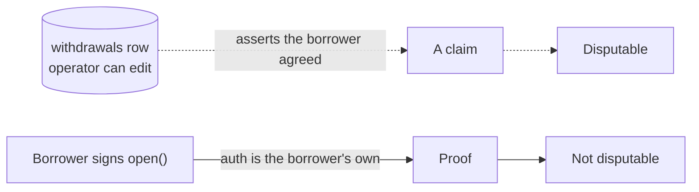

# `advance-registry` — the borrower's own copy of the record

Source: [../contracts/advance-registry/src/lib.rs](../contracts/advance-registry/src/lib.rs)

> **Status: not wired into the app.** A deployed contract id is published as
> `NEXT_PUBLIC_ADVANCE_REGISTRY_ID` in [../.env.example](../.env.example), but no code
> under `app/`, `lib/` or `components/` reads it — nothing calls this contract yet. It is
> a Rust workspace that builds beside the web app. See
> [Before this ships](#before-this-ships).

## Why it exists

Stellend keeps its advance records in Postgres, and that is a real weakness. The borrower's
side of the agreement — how much fiat they were paid, against how much debt, and when they
said they would close it — exists only in a table the operator controls. Nothing stops
that table being rewritten after the fact, and the borrower has no independent copy to
point at.

This contract is the independent copy. The borrower signs a record of what they agreed to,
and it lands on chain **under their own authorisation**. Neither the operator nor a later
migration can alter it.



## What it deliberately does not do

Read this list before reading the API, because it is most of the design:

- **It holds no funds and can move none.** The debt lives in the Blend pool.
- **It does not enforce the close date.** Blend is a perpetual market; nothing on Stellar
  can force a position to close on a date. `due_at` is a commitment the borrower signed,
  and `is_overdue` only *reports* the fact.
- **It is not the authority on whether a debt is outstanding.** The pool is. A borrower who
  never calls `mark_repaid` leaves a stale `Open` record, which costs them their own good
  standing and nothing else.

## Data

```rust
pub struct Advance {
    pub borrower: Address,     // signed this record; holds the debt in the pool
    pub usdc_amount: i128,     // debt drawn, in USDC stroops (7 dp)
    pub try_amount: i128,      // fiat paid out, in TRY minor units (2 dp)
    pub payout_ref: BytesN<32>,// hash of the anchor withdrawal id + destination
    pub opened_at: u64,
    pub due_at: u64,           // committed, not enforced
    pub status: Status,        // Open | Repaid
}
```

`payout_ref` is a **hash, not the values**. An IBAN is personal data and has no business on
a public ledger, but a borrower holding the originals can still prove which payout a record
covers. That is the whole trick: verifiability without publication.

## Functions

| Function | Auth | Behaviour |
|---|---|---|
| `open(borrower, id, usdc_amount, try_amount, payout_ref, due_at)` | `borrower` | Records a new advance. Errors on a duplicate id, a non-positive amount, or a `due_at` in the past or more than ~1 year ahead. Emits `Opened` |
| `mark_repaid(id)` | the record's own `borrower` | Flips `Open` → `Repaid`, once. Emits `Repaid` |
| `get(id)` | none | The record. Reading extends its TTL |
| `is_overdue(id)` | none | `true` only for an `Open` record past its `due_at`. Reporting only |
| `list(borrower)` | none | That borrower's advance ids, oldest first. Empty for an unknown account rather than an error |

### Errors

| Variant | Code | Raised when |
|---|---|---|
| `AlreadyExists` | 1 | The id is taken. Ids are content-addressed by the caller, so a repeat means a replayed request, not a new advance |
| `NotFound` | 2 | No record with that id |
| `InvalidAmount` | 3 | An amount is not strictly positive |
| `InvalidDueDate` | 4 | `due_at` is in the past, or beyond `MAX_TERM_SECONDS` (~1 year) |
| `NotOpen` | 5 | The record is already closed |

### Events

`Opened { borrower (topic), id, usdc_amount, try_amount, due_at }` and
`Repaid { borrower (topic), id }`. `borrower` is a topic so an indexer can follow one
account without replaying the whole ledger.

## Idempotency

`id` is chosen by the caller and must be unique. Stellend would derive it from the borrow
intent, which makes a retried submission fail with `AlreadyExists` rather than writing a
second record for the same advance. This mirrors how the web flow already treats retries
(see [ARCHITECTURE.md](ARCHITECTURE.md#resuming-an-interrupted-advance)) — retry is safe,
duplication is not.

## Storage and TTL

One persistent entry per advance keyed by id, plus one persistent index per borrower. Both
are TTL-extended on **every write and every read**:

```rust
const TTL_THRESHOLD: u32 = 518_400;    // ~30 days of ~5s ledgers
const TTL_EXTEND_TO: u32 = 1_036_800;  // bump back to ~60 days
```

An advance still being serviced — or merely still being watched — cannot be archived out
from under us. Background on Soroban state archival:
<https://developers.stellar.org/docs/build/guides/archival/extend-persistent-entry-js>.

## Build and test

```bash
cd contracts
cargo test                          # unit tests, with snapshots under test_snapshots/
cargo build --target wasm32v1-none --release
```

The release profile is tuned for Wasm size: `opt-level = "z"`, `lto`, `panic = "abort"`,
symbols stripped — with `overflow-checks = true` kept on, because a silently wrapping
`i128` in a money record is worse than a panic.

> **The test suite does not currently match the contract.**
> [../contracts/advance-registry/src/test.rs](../contracts/advance-registry/src/test.rs)
> calls `client.count(&addr)` and a paged `client.list(&addr, &offset, &limit)`, including
> a case asserting that a `u32::MAX` limit is clamped. `lib.rs` defines neither — its
> `list` takes only `borrower` and returns every id. `cargo test` will not compile until
> one side catches up. Adding `count` and a clamped, paged `list` is the reading the tests
> imply, and it is the safer one: an unbounded index read is a real cost risk as a
> borrower's history grows.

## Before this ships

1. Reconcile `list`/`count` with the tests above.
2. Confirm the id in `NEXT_PUBLIC_ADVANCE_REGISTRY_ID` is the build you intend to use, and
   read it through [../lib/env.ts](../lib/env.ts) like every other configured value.
3. Wire `open` into the borrow flow — one more signature, at the end, after the payout
   lands. Budget for the fact that it is a fourth prompt for the borrower to approve.
4. Wire `mark_repaid` into the repay flow.
5. Decide what `payout_ref` hashes over, exactly, and document it — a proof is only useful
   if the borrower can reproduce the input.

None of that is done. Today the contract is a well-tested idea sitting next to the app.
