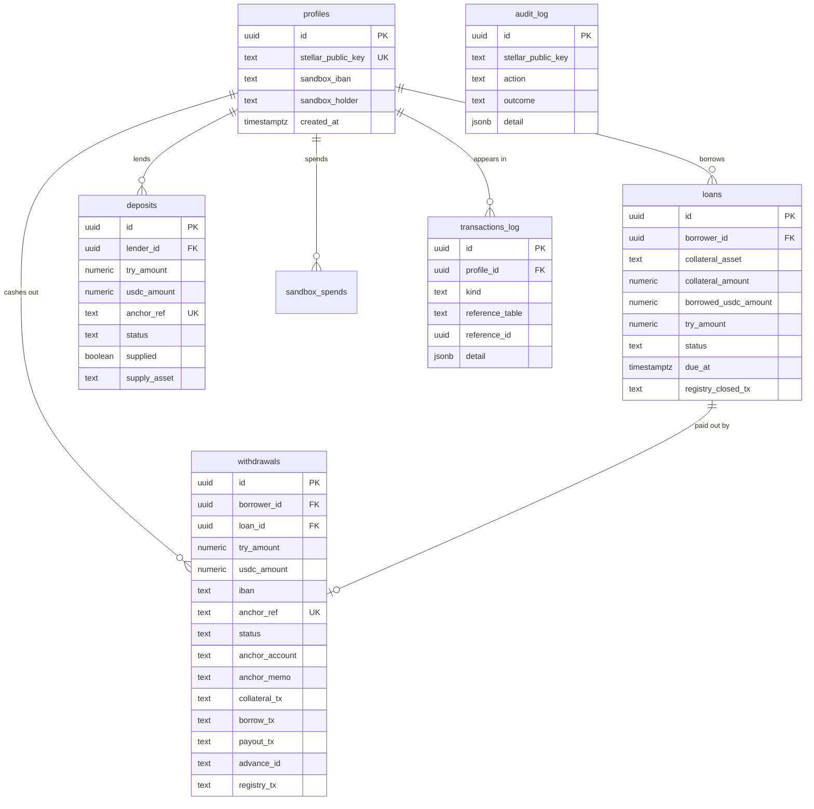
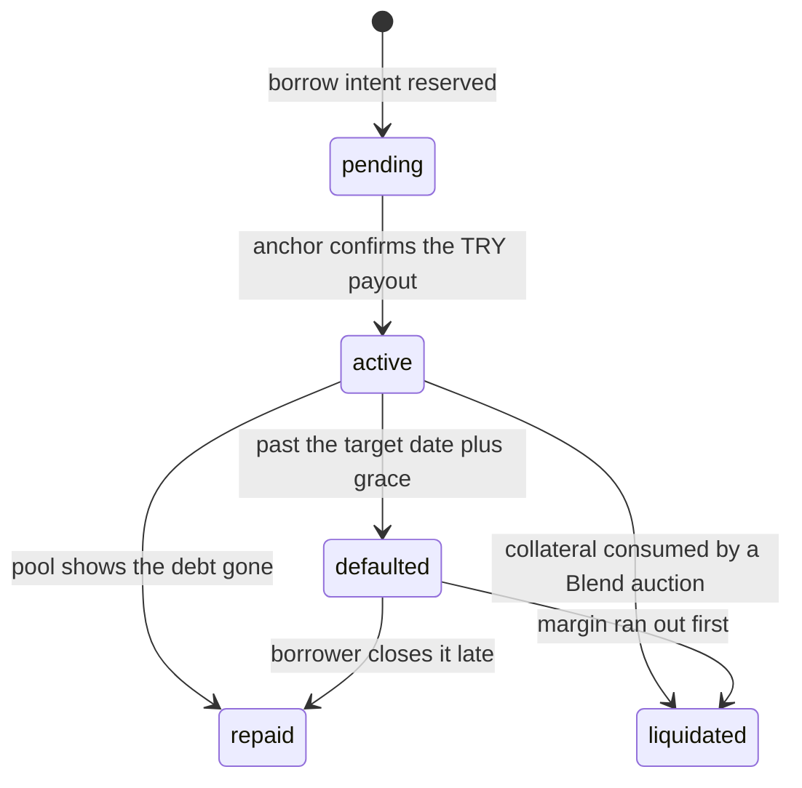

# Data model

The off-chain index. Schema: [../supabase/schema.sql](../supabase/schema.sql).

Read this with one sentence in mind: **these tables are a cache.** The chain holds the
debt, the anchor holds the fiat leg, and Postgres holds a copy so the UI can render
without six RPC calls. Where they disagree, the chain wins — the code is written that way
on purpose (see [ARCHITECTURE.md](ARCHITECTURE.md#where-truth-lives)).

The one exception is `withdrawals`, which is more than a cache: it is the **borrow
intent**, written before anything goes on chain, and it is what every later step is
checked against.

## Tables



`audit_log` deliberately has no foreign key to `profiles`. It records sign-ins, rejected
transactions and money movement, and it has to survive a profile being deleted — a trail
that disappears with the account it is about is not a trail. Keeping it separate from
`transactions_log` also means the user-facing history view never has to filter it out.

## Row Level Security

Every table has RLS enabled and **no policies**, which means only the service role can read
or write. API routes use that role; the browser never talks to Supabase directly. The anon
key exists only so the client library can be constructed.

## Status values

### `loans.status`



`defaulted` is **our own reporting label**, not a state anything acts on. Nothing is
triggered by the date; the keeper sets it so the dashboard can show the position honestly.
`liquidated` is inferred, not observed: a wallet with an active loan, no debt and no
collateral left has had its position auctioned. See
[ECOSYSTEM.md](ECOSYSTEM.md#why-there-is-no-loan-term).

### `deposits.status`

`pending` → `converting` → `completed`, or `failed`. `supplied` is separate and tracks
whether the converted USDC has actually reached the pool — the money can have arrived
without being supplied yet, and the UI has to be able to say so.

### `withdrawals.status`

`pending` → `processing` → `completed`, or `failed`. Advanced from the anchor's SEP-6
transaction status, never from the client.

## The borrow intent, column by column

| Column | Why it exists |
|---|---|
| `try_amount`, `usdc_amount` | The reserved figures. Later steps are bounded by these, not by what the browser sends |
| `iban` | Where the lira goes. Fixed at reservation so it cannot be swapped mid-flow |
| `anchor_account`, `anchor_memo`, `anchor_memo_type` | The payout destination the anchor named. `txguard` checks the payout transaction against these |
| `collateral_asset`, `collateral_amount` | What was posted, for the resume path and the loan row |
| `collateral_tx`, `borrow_tx`, `payout_tx` | Which steps have landed. Together they are the resume stage |
| `loan_id` | Set once the loan row exists; `on delete set null` so history survives |
| `advance_id` | Hex sha256 of the borrow intent — the key the registry record lives under |
| `registry_tx` | Hash of the `open()` transaction, if the borrower signed one |

`loans.registry_closed_tx` is the matching hash for `mark_repaid()`.

### The registry columns are a cache of a cache

`advance_id`, `registry_tx` and `registry_closed_tx` exist so the UI can show "recorded"
without an RPC call. They follow the same rule as everything else here, and the schema says
so at the definition:

> **null means "not observed on-chain", never "does not exist".**

`advance_id` is reproducible from the withdrawal id alone, so a lost value can always be
recomputed. The contract remains the authority on what is recorded; these columns only
speed the page up.

`borrowStage()` in [../lib/borrowIntent.ts](../lib/borrowIntent.ts) reads the last three
plus `status` and returns exactly one stage. That derivation is the whole resume feature —
there is no separate progress field to drift out of sync.

## Applying the schema

```bash
DATABASE_URL=postgres://... npm run db:apply
npm run db:apply -- --dry-run     # print the SQL instead of running it
```

`schema.sql` is the full current schema and runs first; numbered files in
[../supabase/migrations/](../supabase/migrations/) run after it, in order. There is no
applied-migrations table — **idempotency is what makes re-running safe**, so every
statement must be harmless twice (`if not exists`, `where` guards).

## What is not stored

Worth stating plainly, because each absence is a decision:

- **No private keys, and no server keypair.** Non-custody is the product.
- **No KYC data.** SEP-12 is not implemented. A real anchor would require it, and that
  changes this schema.
- **No interest figures.** Interest accrues per ledger in the pool; caching it would only
  create a number that is wrong between reads. The UI asks the pool.
- **No per-loan debt on chain.** Blend tracks one debt position per account, so mapping it
  back onto individual loan rows is an approximation — a known limitation, not a bug.
