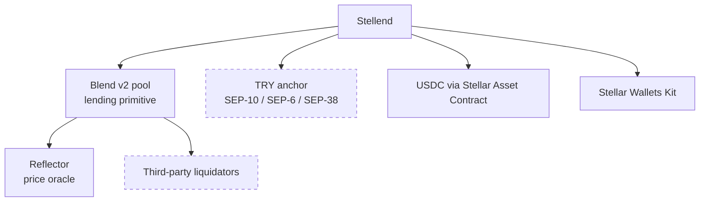

# Ecosystem context

What Stellend depends on in the Stellar ecosystem, what those dependencies constrain, and
who else is in the neighbourhood.

Ecosystem figures below were pulled from the Stellar directory. Protocol behaviour is linked to the official
docs. Anything not sourced here is our own reading, not a fact about the ecosystem.

## The dependency map

The two dashed boxes are the ones that are not really there. **The anchor is a mock**, and
**no liquidator has been shown to turn up for our collateral**. Everything else is live
infrastructure with real usage behind it.

## Blend

- Permissionless, isolated lending pools on Soroban. Suppliers earn yield; borrowers take
  over-collateralised loans. It is the base lending primitive other Stellar DeFi builds on.
- Directory TVL **$151.3M**; SCF-funded; status Live.
- Audit registry: **6 reports** (OtterSec, Certora, Code4rena), with
  code changed since that audit. An audited protocol is not an audited *version* — treat
  the drift as real.
- <https://blend.capital/> · <https://github.com/blend-capital>

We consume Blend through `@blend-capital/blend-sdk` in [../lib/blend.ts](../lib/blend.ts),
against a testnet pool whose id is in [../.env.example](../.env.example).

### Why there is no loan term

This is the single most important thing Blend imposes on the product, so it is worth
stating flatly:

> Blend is a **perpetual** market. Interest accrues from the first ledger and keeps
> accruing. The only thing that ever forces a position to close is its health factor.

Consequences that run all the way into the UI and the schema:

- `due_at` is a *target*, not a deadline. Nothing on chain reads it. The UI says so, and
  [../lib/liquidity.ts](../lib/liquidity.ts) documents it at the definition.
- What a borrower is shown instead is what they owe right now, what today's interest costs,
  and **how far their collateral can fall before it is sold** (`dropUntilLiquidation`).
  That last number is the one that actually matters to them.
- Our `defaulted` status is reporting, not enforcement — see
  [DATA-MODEL.md](DATA-MODEL.md#loansstatus).

### Liquidation is somebody else's job

Blend liquidation is two permissionless steps, and we do neither: someone must call
`newAuction` to open a Dutch auction on an underwater position, and someone with capital
must fill it by repaying the debt in exchange for the collateral.

We warn the borrower as their margin narrows (`AT_RISK_RATIO = 1.2`, against Blend's
liquidation threshold of 1). If no external liquidator shows up, the loss lands on lenders.
**Whether liquidators turn up for our collateral is untested**, and the business plan
treats it as a Phase 2 finding rather than a Phase 0 assumption
([BUSINESS-MODEL.md](BUSINESS-MODEL.md)).

## The SEPs we speak

| SEP | What it does for us | Implementation |
|---|---|---|
| **SEP-1** | `stellar.toml` discovery of the anchor's endpoints | `getAnchorConfig`, `pickTomlValue` |
| **SEP-10** | Web authentication. The signed challenge is our identity | [../lib/sep10.ts](../lib/sep10.ts), [../lib/anchor.ts](../lib/anchor.ts) |
| **SEP-6** | *Programmatic* deposit and withdrawal — our own UI, no anchor iframe | `startSep6Deposit`, `startSep6Withdraw`, `getSep6Transaction` |
| **SEP-38** | Quotes: the TRY↔USDC rate the anchor will honour | `getSep38Quote` |
| **SEP-12** | KYC. **Not implemented** | — |

Official references:

- Anchors and the SEP-6 vs SEP-24 choice:
  <https://developers.stellar.org/docs/learn/fundamentals/anchors>
- SEP-10 authentication:
  <https://developers.stellar.org/docs/platforms/anchor-platform/sep-guide/sep10>
- SEP-6 programmatic deposits and withdrawals:
  <https://developers.stellar.org/docs/platforms/anchor-platform/sep-guide/sep6/integration>
- SEP-38 quotes in a wallet: <https://developers.stellar.org/docs/build/apps/wallet/sep38>
- KYC fields (SEP-12): <https://developers.stellar.org/docs/build/apps/wallet/sep6>
- Stellar Asset Contract, which is how classic USDC is callable from the pool:
  <https://developers.stellar.org/docs/build/guides/tokens/stellar-asset-contract>

### Why SEP-6 and not SEP-24

SEP-24 hands the user off to an anchor-hosted page. SEP-6 keeps the flow in our UI, which
is what lets the borrow flow be *one* sequence — quote, reserve, sign, sign, sign — instead
of a handoff in the middle of it. The cost is that we carry the KYC obligation ourselves
when a real anchor demands one, and SEP-12 is exactly the piece that is missing.

## The anchor gap — the honest part

**We could not find a live Turkish lira anchor in the ecosystem directory.** Querying the
Live-status anchor roster returned rows for MoneyGram, Bitso, Yellow Card,
Fonbnk, MYKOBO, Coins.ph, Anclap, VERSO, TuCambio, Clickspesa and others — covering USD,
EUR, LATAM, African and Philippine corridors. No TRY.

The one Turkey-focused project in the directory is **Sava** (Stablecoin, Live), whose
description notes Turkey's very high crypto adoption — over 25% of the population, roughly
25M people. That is the market thesis restated by someone else; it is not a ramp we can
call.

So:

- Our anchor is `tr-mock-anchor.fly.dev`. Every fiat leg is simulated.
- This is dependency #1 in
  [BUSINESS-MODEL.md § What has to be true](BUSINESS-MODEL.md#5-what-has-to-be-true-for-this-to-work),
  and it is correctly placed first.
- Turkey's crypto-asset service provider regime (CMB licensing) and MASAK/KYC
  obligations mean the realistic shape is a feature inside a licensed partner, not an
  independent product. That is a legal question, not an engineering one, and nothing in
  this repository resolves it.

Absence in a directory is not proof of absence in the world. It does mean that
there was no obvious partner to call.

## Neighbours worth knowing

Live Stellar projects in adjacent verticals. None is a
direct competitor — nobody else in the directory is doing crypto-collateralised **lira**
cash advances — but each shares a piece of the design.

| Project | Overlap with us |
|---|---|
| **Blend** | Our dependency, not our competitor |
| **Turbolong** | One-click leveraged longs *on Blend positions* — the nearest thing to a peer in how it composes on the pool |
| **YieldBack.Cash** | Coupon bonds backed by Blend pools — another product built on the same primitive |
| **DeFindex** (PaltaLabs) | Tokenized vaults that route stablecoin deposits into protocols including Blend, behind one SDK. TVL **$20.2M**. If we ever want lender-side yield without owning a pool, this is the shape |
| **Reflector** | The oracle Blend reads. Our liquidation threshold is only as good as its prices |
| **Vaquita**, **Microvault** | Savings and microlending aimed at underbanked users — same social thesis, different rails |

Supply-side context: the Anchor vertical shows **37 active directory projects, 19 of them
SCF-funded**. Anchors are not a gap in the ecosystem — a *Turkish* anchor is.

## Where we are unusual

Three things about this codebase are not the common pattern, and they are the parts worth
defending in a review:

1. **Non-custody with a fiat leg.** Most fiat-backed crypto lending is exchange-custodied.
   Here the server holds no key; the wallet signs everything and the server verifies
   ([ARCHITECTURE.md](ARCHITECTURE.md#what-txguard-actually-checks)).
2. **Ordering as a safety property.** Nothing goes on chain until the anchor has agreed to
   pay out, so a borrower cannot end up with debt and no cash. Combined with the resumable
   intent row, this is the part of the design that protects real money.
3. **Refusing to pretend there is a term.** The straightforward thing is to show a due date
   and let borrowers assume it means something. This product says the opposite, in the UI,
   because the pool would not honour it.

## Snapshot caveats

Every ecosystem figure here is dated. TVL, audit drift, project status and the anchor
roster all move. Before quoting any of it — in a grant application, a pitch, or a README —
re-run the query rather than copying this page. The protocol behaviour (perpetual markets,
the SEP semantics) is stable; the numbers are not.
